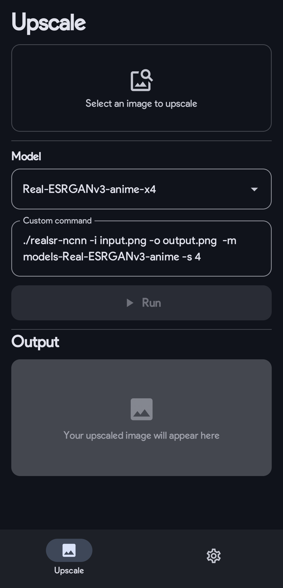
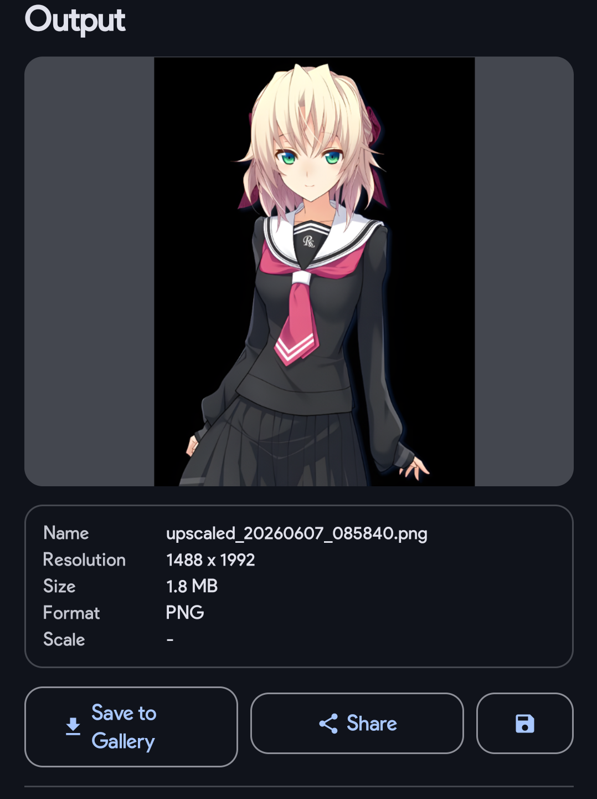
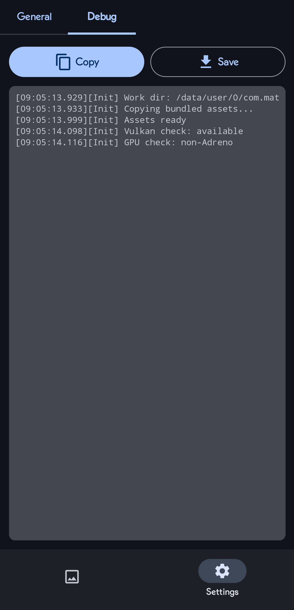

# MatUnCNN

Android native image upscaler powered by [ncnn](https://github.com/Tencent/ncnn). Uses AI models to upscale images with high quality on-device, with Vulkan GPU acceleration.

**Forked from** [Tumuyan/RealSR-NCNN-Android](https://github.com/tumuyan/RealSR-NCNN-Android) — rewritten in Kotlin with Jetpack Compose (Material 3), dynamic model downloading, result caching, and several stability improvements.

---

## Screenshots

<div align="center">
  
  
  
</div>

> Screenshots taken on Mali-G52 | 4gb

---

## Features

- **AI Image Upscaling** — select from multiple ncnn models (Real-ESRGAN, RealSR, etc.)
- **Vulkan GPU Acceleration** — automatic Vulkan detection; falls back to CPU gracefully
- **Progress Tracking** — real-time ETA and percentage parsed from ncnn stdout
- **Output Preview** — pinch-to-zoom viewer with image metadata; save or share the result
- **Result Caching** — in-memory LRU cache avoids redundant processing
- **Noexec Bypass** — runs binaries on noexec-mounted filesystems via `/proc/self/fd`
- **Dynamic Asset Download** — model `.bin`/`.param` files fetched from GitHub Releases on first launch
- **Debug Log** — 500-entry ring buffer with copy-to-clipboard and file save
- **Customizable** — tile size, thread count, save format/name, notification mode, custom command arguments
- **Material 3 UI** — dark theme, bottom navigation, scrollable settings

---

## Requirements

- Android 8.0+ (API 26+)
- Vulkan-compatible GPU recommended (CPU fallback available)

---

## Installation

Download the latest APK from the [Releases](https://github.com/Celesth/MatUnCNN/releases) page and install it.

Model assets are downloaded automatically on first launch.

---

## Building

Requires JDK 17 and Android SDK with NDK 27+ and CMake 3.22+.

```shell
./gradlew assembleRelease -Dorg.gradle.java.home=/path/to/jdk-17
```

---

## Usage

1. Launch the app — model assets download on first run
2. Tap the image card to select an image
3. Choose a model from the dropdown
4. Tap **Run** to upscale
5. View the result in the output card; save or share from there

Tweak settings in the **Settings** tab: tile size, thread count, save format, naming scheme, custom arguments, and notification mode.

---

## Adding Models

Place `.bin` + `.param` file pairs into the `models/` folder. The app will detect and list them automatically.

Compatible sources:
- [Real-ESRGAN releases](https://github.com/xinntao/Real-ESRGAN/releases) — grab the `ncnn` zip from assets
- [Upscayl model pack](https://github.com/upscayl/upscayl-ncnn/tree/master/models)
- [RealSR-NCNN-Android assets](https://github.com/tumuyan/RealSR-NCNN-Android/tree/master/app/src/main/assets)

To convert a PyTorch `.pth` model yourself: `PyTorch → ONNX → ncnn` using `torch.onnx.export` and `onnx2ncnn`.

---

## Known Issues

- **Black output on some Adreno GPUs** — `vkQueueSubmit failed -4` (`VK_ERROR_DEVICE_LOST`) is a known upstream ncnn issue on Qualcomm Adreno drivers. The GPU watchdog kills heavy shader dispatches before they complete. Workarounds: use a lighter model (x2 or anime variant), or reduce tile size in settings. Tracked upstream at [Tencent/ncnn#925](https://github.com/Tencent/ncnn/issues/925).

---

## Tech Stack

| Layer | Tech |
|---|---|
| Language | Kotlin + C++ |
| UI | Jetpack Compose / Material 3 |
| Inference | ncnn (Vulkan) |
| Image processing | ImageMagick |
| Image loading | Coil |
| Preferences | DataStore |
| Min SDK | API 26 (Android 8.0) |

---

## Credits

- [nihui](https://github.com/nihui) — ncnn and realsr-ncnn-vulkan
- [Tumuyan](https://github.com/tumuyan) — original RealSR-NCNN-Android
- [xinntao](https://github.com/xinntao) — Real-ESRGAN

---

## License

MIT
